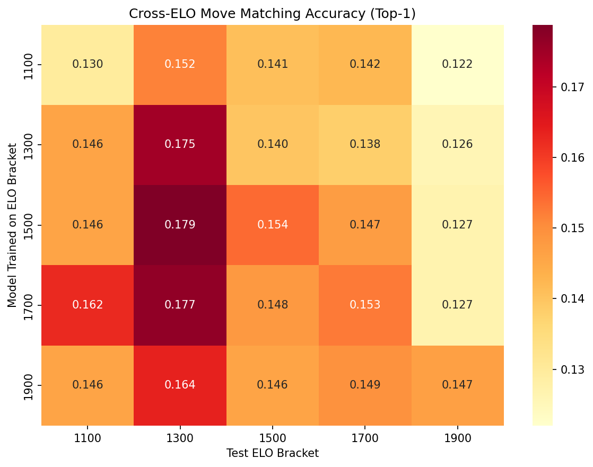
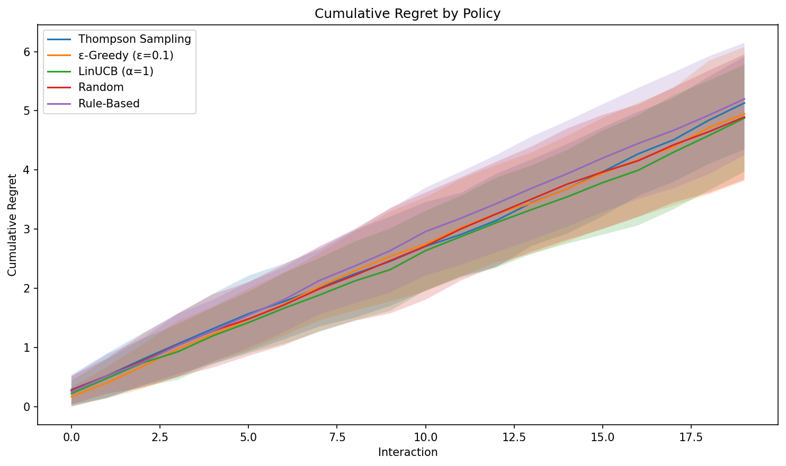
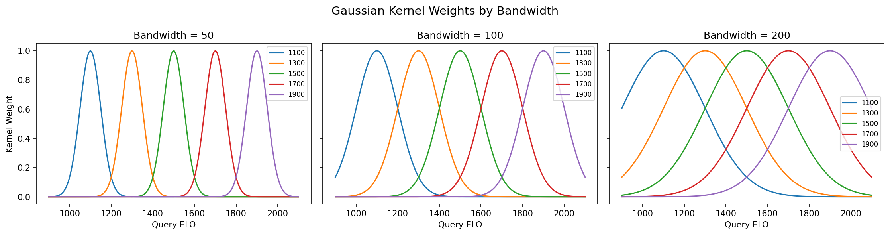
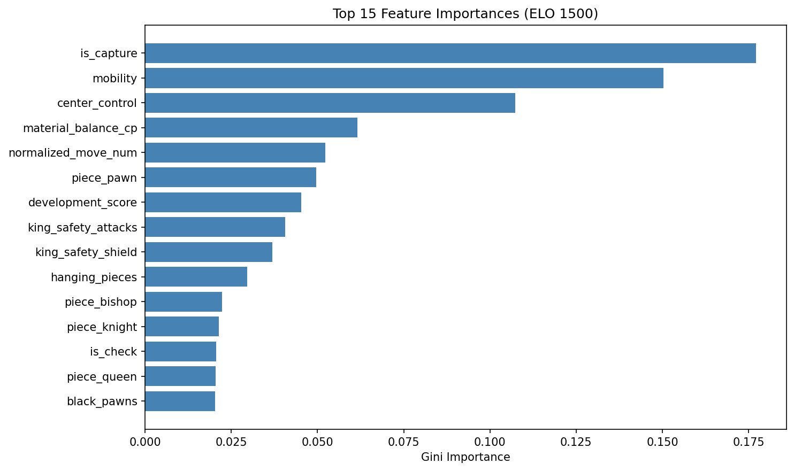

# Chess Tutor: Adaptive Teaching with Probabilistic ML

> **STA 561D — Probabilistic Machine Learning, Duke University**
>
> An adaptive chess tutoring system that predicts human moves at any ELO level (1100–1900), provides skill-appropriate feedback, and uses contextual Thompson Sampling to select optimal teaching strategies.

## Key Ideas

1. **ELO-Conditioned Move Prediction** — Given a board position and a target ELO, predict which move a human at that skill level would play. Three architectures compared: per-bracket models (A), pooled with ELO feature (B), and Nadaraya-Watson kernel interpolation across brackets (C).

2. **Kernel Interpolation (Novel Contribution)** — Gaussian kernel smoothing over ELO brackets enables continuous skill-level queries without retraining. Bandwidth selected via leave-one-bracket-out CV.

3. **Contextual Thompson Sampling** — A linear contextual bandit selects among 7 feedback types (tactical alert, blunder warning, encouragement, etc.) based on a 20-dimensional context vector capturing board state, student skill, and position complexity.

4. **Student Simulator** — A ZPD-based learning model simulates student improvement for offline policy evaluation: `p_learn = lr × relevance × (1 - mastery)`.

## Results

| Metric | Value |
|--------|-------|
| Move prediction top-1 accuracy | 13–17% (vs ~3% random) |
| Move prediction top-5 accuracy | 34–44% |
| Cross-ELO diagonal dominance | 4/5 brackets |
| Blunder detection AUC | 0.926 |
| Thompson Sampling vs Random | +12.3% reward |
| Regret | Sub-linear ✓ |

<p align="center">
  
  
</p>
<p align="center">
  
  
</p>

## Project Structure

```
sta561_chess_tutor/
├── chess_tutor/                # Main package (35 modules, ~3500 LOC)
│   ├── config.py               # Global constants and hyperparameters
│   ├── data/                   # Data pipeline
│   │   ├── download.py         #   Lichess PGN downloader
│   │   ├── parse_pgn.py        #   PGN → position records
│   │   ├── extract_features.py #   30 board + 10 move features
│   │   ├── stockfish_eval.py   #   Stockfish wrapper
│   │   └── dataset.py          #   ChessTutorDataset class
│   ├── models/                 # ML models
│   │   ├── move_predictor.py   #   Architectures A, B, C
│   │   ├── kernel_interpolation.py  # Nadaraya-Watson ELO kernel
│   │   └── position_eval.py    #   BlunderDetector, PositionComplexity
│   ├── feedback/               # Feedback generation
│   │   ├── taxonomy.py         #   7 feedback types (enum)
│   │   ├── templates.py        #   ELO-adaptive templates
│   │   └── generator.py        #   FeedbackGenerator
│   ├── teaching/               # Adaptive teaching engine
│   │   ├── bandit.py           #   Thompson Sampling + 5 baselines
│   │   ├── context.py          #   20-dim context builder
│   │   └── reward.py           #   Reward computation
│   ├── simulation/             # Offline evaluation
│   │   ├── student_simulator.py #  StudentSimulator + StudentPopulation
│   │   └── runner.py           #   Episode runner + experiment harness
│   ├── bot/                    # Interactive demo
│   │   ├── player.py           #   ChessTutorBot (KL-regularized)
│   │   └── commentary.py       #   Move-by-move commentary
│   ├── evaluation/             # Metrics and ablation
│   │   ├── metrics.py          #   Regret, entropy, AUC, etc.
│   │   └── ablation.py         #   Ablation suite
│   ├── student/model.py        # StudentState dataclass
│   ├── utils/
│   │   ├── helpers.py          #   sigmoid, softmax, normalization
│   │   └── visualization.py    #   10 plot functions
│   └── demo/
│       └── chess_tutor_demo.ipynb  # Interactive demo notebook
├── scripts/                    # Training and evaluation scripts
│   ├── build_candidate_dataset.py
│   ├── train_and_evaluate.py
│   ├── run_phase3_4_5.py
│   └── run_final_experiment.py
├── results/
│   ├── plots/                  # All generated figures
│   ├── ablation_table.csv
│   └── bandit_comparison.csv
├── guidance/                   # Project specification documents
├── requirements.txt
└── README.md
```

## Setup

```bash
# Create conda environment
conda create -n chess_tutor python=3.14 -y
conda activate chess_tutor

# Install dependencies
pip install -r requirements.txt
```

## Reproducing Results

```bash
# 1. Download Lichess data (~93MB decompressed)
python -c "from chess_tutor.data.download import download_lichess_pgn; download_lichess_pgn(2013, 1)"

# 2. Build dataset with features
python -c "
from chess_tutor.data.dataset import ChessTutorDataset
dataset = ChessTutorDataset(data_dir='data/processed/')
dataset.build_from_pgn(['data/raw/lichess_2013_01.pgn'])
dataset.save('chess_tutor_v1')
"

# 3. Build candidate-move dataset for ranking
python scripts/build_candidate_dataset.py

# 4. Train move predictors (Architectures A, B, C)
python scripts/train_and_evaluate.py

# 5. Run blunder detection, bandit experiments, generate all plots
python scripts/run_final_experiment.py

# 6. Launch demo notebook
jupyter notebook chess_tutor/demo/chess_tutor_demo.ipynb
```

## Methods

### Feature Engineering (30 board + 10 move features)

| Features | Dimensions | Description |
|----------|-----------|-------------|
| Piece counts | 12 | White/Black P, N, B, R, Q, K |
| Material balance | 1 | Centipawn difference |
| Mobility | 1 | Legal move count |
| King safety | 2 | Pawn shield + zone attacks |
| Center control | 1 | Pieces/attacks on central squares |
| Pawn structure | 4 | Isolated, doubled, passed, islands |
| Development | 1 | Minor pieces off starting squares |
| Castling rights | 4 | Binary flags |
| Game phase | 3 | Opening/middlegame/endgame one-hot |
| Hanging pieces | 1 | Undefended pieces under attack |
| Move features | 10 | Capture, check, piece type, cp loss, move number |

### Move Prediction Architectures

- **Architecture A**: Train separate Random Forest per ELO bracket (Maia-1 style)
- **Architecture B**: Single pooled RF with normalized ELO appended as feature
- **Architecture C**: Train per-bracket models, combine via Nadaraya-Watson kernel:

`P(m | x, s*) = Σ_k K_h(s* - s_k) · P_k(m | x) / Σ_k K_h(s* - s_k)`

where `K_h` is a Gaussian kernel with bandwidth `h` selected by leave-one-bracket-out CV.

### Contextual Thompson Sampling

For each feedback arm `a`, maintain Bayesian linear regression `r = θ_a'x + ε` with posterior `N(μ̂_a, v² B_a⁻¹)`.

**Select**: Sample `θ̃_a ~ N(μ̂_a, v² B_a⁻¹)`, play `argmax_a θ̃_a'x`

**Update**: `B_a ← B_a + x x'`, `f_a ← f_a + r · x`, `μ̂_a ← B_a⁻¹ f_a`

### Feedback Types

| # | Type | Target Concepts |
|---|------|----------------|
| F1 | Tactical Alert | Tactics |
| F2 | Strategic Nudge | Strategy, positional play |
| F3 | Blunder Warning | Tactics, calculation |
| F4 | Pattern Recognition | Openings, endgames |
| F5 | Move Comparison | Calculation, strategy |
| F6 | Encouragement | General reinforcement |
| F7 | Simplification | Endgame, strategy |

## References

- McIlroy-Young et al. (2020). *Aligning Superhuman AI with Human Behavior: Chess as a Model System.* KDD 2020. (Maia-1 — Architecture A per-ELO models)
- Skidanov et al. (2025). *BP-Chess: Handcrafted Features for Human Move Prediction.* arXiv:2504.05425. (Feature engineering approach)
- Nadaraya (1964). *On Estimating Regression.* Theory of Probability and Its Applications. (Kernel interpolation — Architecture C)
- Agrawal & Goyal (2013). *Thompson Sampling for Contextual Bandits with Linear Payoffs.* ICML 2013. (Teaching engine)
- Li et al. (2010). *A Contextual-Bandit Approach to Personalized News Article Recommendation.* WWW 2010. (LinUCB baseline)
- Clement et al. (2015). *Multi-Armed Bandits for Intelligent Tutoring Systems.* JEDM. (ZPD-based student simulator)
- Jacob et al. (2022). *Modeling Strong and Human-Like Gameplay with KL-Regularized Search.* ICML 2022. (KL-regularized bot)

